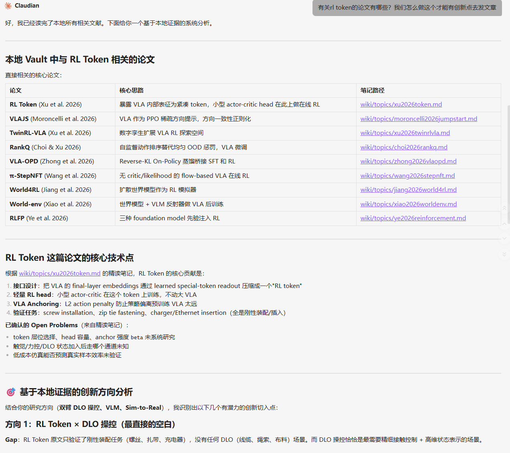
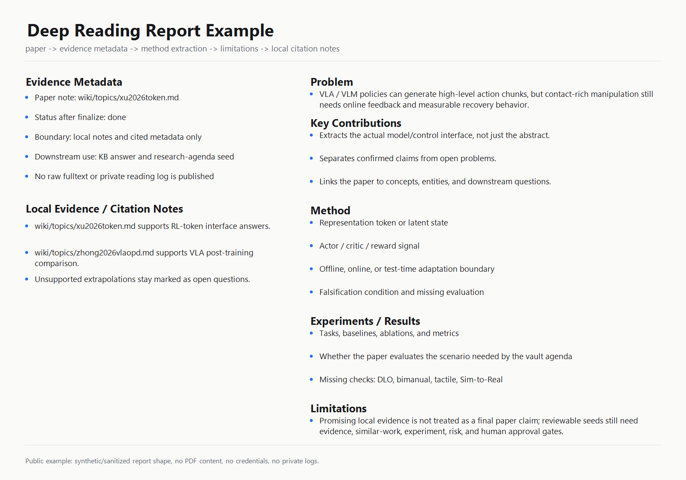
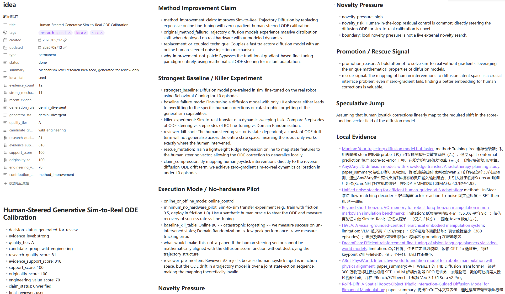
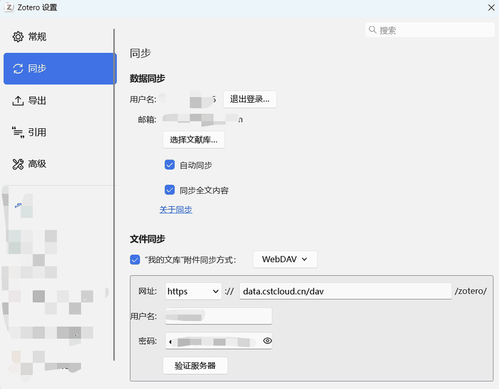

# Local-First Research Vault

> Turn Zotero / arXiv papers into a local domain expert: long-term literature memory, evidence-grounded answers, deep reading, research hypotheses, and reviewable experiment-plan drafts.

[中文 README](README.md)

This is an Obsidian / Zotero vault template for researchers working with a specialized literature corpus. More precisely, it is a **local domain-expert vault**: instead of sending every question to a generic AI chat, it organizes the papers, concepts, entities, deep-reading reports, local retrieval, and research idea drafts of one field into traceable evidence.

The phrase "domain expert" does not mean this repository trains a new model. It means LLM-assisted reading, comparison, brainstorming, and experiment-plan drafting are constrained by local `wiki/` evidence, Zotero sources, concept networks, and human-review boundaries. The system is meant to behave like a research colleague that has long-term memory of your literature corpus, while keeping claims traceable.

The public vault uses robotic manipulation as its example domain, especially DLO manipulation, VLM/VLA systems, RL, Sim-to-Real, and embodied AI. The workflow is portable, but the papers, concepts, entities, Claudian prompts, and arXiv filters are domain-specific and should be replaced for another field.

It is useful for graduate students, PI/lab knowledge-base maintainers, and researchers who want LLM assistance to behave more like a local domain expert grounded in their own literature corpus.

## What this is / is not

This is:

- a local domain-expert vault with long-term literature memory;
- an evidence-grounded workflow that searches `wiki/topics/`, `wiki/concepts/`, and `wiki/entities/` before writing domain answers;
- a Zotero / Obsidian / Claudian workflow for import, deep reading, finalization, audits, comparison, and concept maintenance;
- a research-agenda seed system for reviewable hypotheses, baselines, risks, and experiment-plan drafts;
- a sanitized public package without API keys, PDFs, SQLite mirrors, Zotero caches, logs, or personal machine paths.

This is not:

- a fully automated research system that works end-to-end immediately after cloning;
- a generator of verified novelty claims or experimental results;
- a PDF repository; PDFs remain managed by Zotero, WebDAV, or linked attachments;
- a robotics-only project; robotics is the example corpus.

## What works immediately after cloning

Without Zotero, Claudian, Gemini, or Codex, you can run:

```powershell
python .claude/scripts/audit_kb.py
python .claude/scripts/kb_search.py "diffusion policy DLO" --limit 5
```

These commands validate the local knowledge structure and return evidence paths under `wiki/`. Obsidian is optional, but recommended for graph view, backlinks, dashboards, and reading notes.

## What requires additional setup

| Capability | Requires |
| --- | --- |
| Importing Zotero metadata | Zotero API key, user ID, collection key, or local Zotero Desktop |
| Jumping from Obsidian notes to Zotero item / PDF | Zotero Desktop, PDF attachment, Paper Reading Workbench |
| Claudian / Claude Code reading and QA commands | Local CLI, model account, explicit permission choices |
| Daily arXiv scouting and idea seeds | Local arXiv SQLite metadata mirror and network; full mode needs Zotero / Gemini / Codex |
| PDF syncing | Zotero storage, WebDAV, or linked attachments; PDFs are not committed |

Setup entry points:

- Obsidian / Claudian: [docs/OBSIDIAN_CLAUDIAN_SETUP.md](docs/OBSIDIAN_CLAUDIAN_SETUP.md)
- Zotero API, WebDAV, attachments: [docs/ZOTERO_STORAGE.md](docs/ZOTERO_STORAGE.md)
- Automation, scheduled tasks, arXiv mirror-first: [docs/AUTOMATION.md](docs/AUTOMATION.md)
- Paper Reading Workbench security boundary: [docs/SECURITY_PLUGIN_WORKBENCH.md](docs/SECURITY_PLUGIN_WORKBENCH.md)

## Local Domain Expert Model

The goal is not to replace the researcher. It is to let an LLM accumulate context inside one specialized field and make careful research habits explicit and repeatable:

- **Long-term memory**: papers, concepts, authors, systems, and datasets live in `wiki/`, so the system remembers a field instead of starting from a blank chat.
- **Evidence discipline**: domain answers start from local retrieval; missing support is marked as an evidence gap rather than smoothed over.
- **Deep reading**: Zotero items can become topic notes, Claudian reading reports, finalized notes, audits, and reusable evidence.
- **Knowledge network**: papers connect to concept pages and entity pages, so later questions can follow methods, authors, datasets, and systems.
- **Hypothesis drafting**: research-agenda creates reviewable idea seeds; it does not treat local evidence as proven novelty.
- **Experiment-plan drafts**: idea seeds can be expanded into baselines, discriminating experiments, no-hardware pilots, failure conditions, and human review fields.

## What Problem It Solves

Modern research workflows often split knowledge across PDFs, Zotero, Obsidian, AI chats, and scattered project folders. AI assistants can produce fluent summaries, but those summaries are often hard to trace back to local evidence.

This vault makes the workflow local-first:

```text
Zotero / arXiv
    ↓
wiki/topics/        one structured note per paper
    ↓
wiki/concepts/      reusable concept pages
    ↓
wiki/entities/      authors, labs, datasets, systems
    ↓
kb_search.py        local evidence retrieval before answering
    ↓
Claudian reading     deep reading reports and finalized notes
    ↓
research-agenda      reviewable idea seeds and automation logs
```

The core principle is **local-first answerability**: domain answers should point back to local `wiki/` notes, concept pages, entity pages, or explicit evidence gaps.

## Example Outputs

Claudian can answer a research question by first retrieving local notes and then grounding the answer in concrete paper pages:



Deep reading reports are the middle layer between a paper and downstream answers. They convert a paper into evidence metadata, method extraction, experiment notes, limitations, and local citation notes:



Full example: [docs/examples/deep-reading-report-example.md](docs/examples/deep-reading-report-example.md).

The research-agenda workflow can turn local evidence into reviewable idea seeds with method claims, baseline analysis, novelty pressure, risk notes, and no-hardware pilot plans:



## Adapting To Another Field

Robotics is only the example domain. To migrate the workflow, keep the local-first structure and replace the domain layer:

| Replace | With your own field's equivalent |
| --- | --- |
| `wiki/topics/` | Paper notes for your literature corpus |
| `wiki/concepts/` | Methods, tasks, theories, metrics, and datasets |
| `wiki/entities/` | Authors, labs, institutions, systems, datasets |
| `.claude/commands/` | Domain-specific import, reading, search, and comparison prompts |
| `.claude/scripts/daily_arxiv_pipeline.py` | Search queries, ranking keywords, and review filters |
| `.claudian/claudian-settings.json` | System prompt, tone, and local safety policy |

## What Is Included

| Path | Purpose |
| --- | --- |
| `wiki/topics/` | Structured literature notes |
| `wiki/concepts/` | Concept pages for methods, tasks, and theory |
| `wiki/entities/` | Authors, labs, datasets, systems, and organizations |
| `.claude/commands/` | Project commands for Claudian / Claude Code workflows |
| `.claude/scripts/` | Local retrieval, auditing, Zotero import, arXiv automation |
| `.claudian/claudian-settings.json` | Sanitized Claudian behavior configuration |
| `.obsidian/` | Vault-level Obsidian configuration |
| `docs/` | Setup, automation, Zotero storage, and privacy documentation |

The public package excludes private API keys, PDF caches, SQLite caches, logs, personal paths, and machine-specific runtime state.

## Quick Start

Run these commands from the repository root:

```powershell
python .claude/scripts/audit_kb.py
python .claude/scripts/kb_search.py "diffusion policy DLO" --limit 5
```

Open the folder as an Obsidian vault to browse `wiki/`, backlinks, graph view, and dashboard pages.

## Optional Dependencies

The base vault only needs Python for local audit and search. Extra integrations are opt-in:

| Integration | Needed for |
| --- | --- |
| Obsidian plugins | Graph/dashboard ergonomics, Smart Connections, Claudian UI |
| Paper Reading Workbench | Bundled local plugin for opening Zotero items/PDF attachments from literature notes; Zotero Desktop and a stored/linked PDF are still required |
| Zotero Desktop / Web API | Importing papers and syncing metadata |
| CSTCloud WebDAV or another storage route | Syncing Zotero stored attachments |
| Claudian / Claude Code | AI-assisted deep reading and project commands |
| Gemini CLI | Divergent research idea generation |
| Codex CLI | Optional second-pass seed review |

Paper Reading Workbench is bundled and enabled in the public vault. Open a `wiki/topics/*.md` note with `zotero_key`, then run `Paper Reading Workbench: Open paper reading workbench for current note`. The plugin queries the local Zotero Connector API, creates a `projects/reading-workbench/<ZOTERO_KEY>-zotero-source.md` source note, and provides links back to the Zotero item, Zotero PDF attachment, and arXiv PDF fallback. Zotero Desktop must be open, and the Zotero item must already have a stored or linked PDF attachment. The plugin does not copy PDFs into the vault. It is local executable Obsidian plugin code; translation and diagram actions spawn the local Python helper scripts only when you click those actions.

Read [Paper Reading Workbench Security Notes](docs/SECURITY_PLUGIN_WORKBENCH.md) for the plugin's read scope, write directories, Python helper boundary, and disable path.

## Zotero Setup

Zotero is optional for browsing and local search. It is needed for import and automation.

To use the Web API route:

1. Open [Zotero API Keys](https://www.zotero.org/settings/keys).
2. Create a private key.
3. Use `Read` permission for import and inspection.
4. Add `Write` permission only when automation should create items or update collections.
5. Configure local environment variables:

```powershell
setx ZOTERO_USER_ID "<your-zotero-user-id>"
setx ZOTERO_API_KEY "<your-zotero-api-key>"
setx ZOTERO_COLLECTION_KEY "<your-collection-key>"
```

Open a new PowerShell window, then verify:

```powershell
python .claude/scripts/zotero_import.py --preflight --json
```

For attachment syncing, this vault documents a CSTCloud Data Capsule WebDAV route:



See [docs/ZOTERO_STORAGE.md](docs/ZOTERO_STORAGE.md) for details.

## Claudian / Claude Code

Claudian / Claude Code is optional. The repository can be inspected and searched without MCP servers.

Recommended public default:

- Required MCP: none
- Optional MCP: Zotero and arXiv for full automation
- Optional tools: Gemini / Codex for divergent idea generation and review

Project commands include:

| Command | Purpose |
| --- | --- |
| `/search-kb` | Search local wiki before answering |
| `/ingest-paper` | Import one Zotero item |
| `/read-paper` | Read, analyze, finalize, and audit one paper |
| `/compare-papers` | Compare two local paper notes |
| `/update-concepts` | Upgrade concept pages from evidence |

## Automation

The daily arXiv workflow is **local metadata mirror first**. It incrementally harvests arXiv metadata through the official OAI-PMH endpoint into a local SQLite database, ranks recent candidates from that local mirror, and uses the arXiv Search API only as a fallback/troubleshooting path in real daily runs when the mirror is stale or insufficient. The mirror stores metadata and PDF URLs, not PDF files.

Start with zero-write checks before enabling scheduled tasks:

```powershell
python .claude/scripts/arxiv_metadata_sync.py --dry-run --days-back 14 --max-pages 1
python .claude/scripts/arxiv_metadata_sync.py --status
python .claude/scripts/daily_arxiv_pipeline.py --dry-run --source mirror-first --max-candidates 5 --days-back 14 --idea-mode template --skip-read
```

If `--status` reports `missing=true`, the local SQLite mirror has not been created yet. In that case, the pipeline dry-run reports `arxiv_mirror_missing` quickly instead of silently using Search API fallback. If a tiny mirror exists but has too few matching papers, dry-run reports `arxiv_mirror_insufficient`. To preview real ranked candidates, first create a small local mirror:

```powershell
python .claude/scripts/arxiv_metadata_sync.py --incremental --days-back 14 --max-pages 1
python .claude/scripts/daily_arxiv_pipeline.py --dry-run --source mirror-first --max-candidates 5 --days-back 14 --idea-mode template --skip-read
```

Search API mode is a fallback/troubleshooting path because external services can return 429, timeout, or empty results. A Search API failure does not by itself mean the vault is broken.

arXiv data layer:

- OAI-PMH sync builds `projects/arxiv-daily/metadata/arxiv_metadata.sqlite`.
- The SQLite mirror stores metadata only: title, authors, abstract, dates, categories, URL, PDF URL, DOI, journal reference, comments.
- Default OAI-PMH sets are `cs` and `stat`; this is not a bundled all-arXiv database.
- The public repository does not include the SQLite mirror. Use `python .claude/scripts/arxiv_metadata_sync.py --status` to inspect your local mirror; this command is read-only and does not create the database when it is missing.
- Zotero import later uses selected metadata and PDF URLs to create library items; PDFs are managed by Zotero storage, WebDAV, or linked attachments.

Windows Task Scheduler setup and dry-run examples are documented in [docs/AUTOMATION.md](docs/AUTOMATION.md).

## Documentation

Detailed docs are currently Chinese-first. The links below are still useful because commands, paths, and configuration keys are shown explicitly.

- [Getting Started](docs/GETTING_STARTED.md)
- [Obsidian and Claudian Setup](docs/OBSIDIAN_CLAUDIAN_SETUP.md)
- [Automation](docs/AUTOMATION.md)
- [Zotero Storage and Attachments](docs/ZOTERO_STORAGE.md)
- [Security and Privacy](docs/SECURITY_AND_PRIVACY.md)
- [Paper Reading Workbench Security Notes](docs/SECURITY_PLUGIN_WORKBENCH.md)

## License

Code and documentation are released under the [MIT License](LICENSE). Third-party papers, figures, datasets, models, plugins, and services remain governed by their original licenses and terms.
