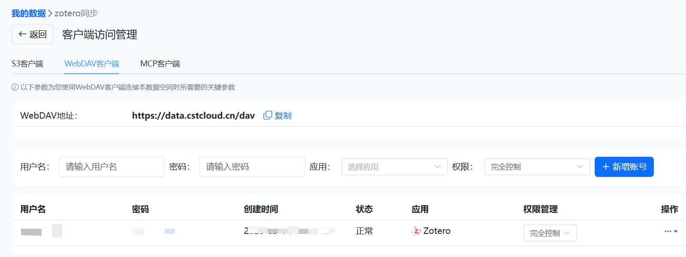

# Zotero Storage And Attachments

This vault does not ship any private Zotero account, WebDAV server, API key, attachment directory, or PDF cache. You must choose and configure your own attachment strategy.

## What This Vault Needs From Zotero

The workflow can use Zotero in three levels:

| Level | Need | What works |
| --- | --- | --- |
| Metadata only | Zotero item metadata | Import title, authors, year, abstract, DOI, URL |
| Local fulltext | Zotero Desktop with local attachments | Claudian can read PDFs/fulltext from your machine |
| Syncable attachments | Stored PDF or configured linked attachment route | Daily automation can keep papers, notes, and PDF status aligned |

If you only browse `wiki/` or run `kb_search.py`, you do not need Zotero storage at all.

## Zotero API Key Setup

WebDAV credentials and Zotero API keys solve different problems:

- WebDAV credentials let Zotero Desktop sync PDF attachments.
- `ZOTERO_API_KEY` lets scripts read or write Zotero metadata through Zotero's Web API.

To create a key:

1. Log in to Zotero and open [Zotero API Keys](https://www.zotero.org/settings/keys).
2. Choose `Create new private key`.
3. Grant `Read` permission if the vault only needs to inspect your library.
4. Grant `Write` permission only if automation should create items, add items to collections, or repair Zotero attachment records.
5. Copy the numeric user id from the API key page. It is not your username or email address.
6. Keep the generated key private. Do not commit it, paste it into public issues, or include it in screenshots.

PowerShell configuration:

```powershell
setx ZOTERO_USER_ID "<your-zotero-user-id>"
setx ZOTERO_API_KEY "<your-zotero-api-key>"
setx ZOTERO_COLLECTION_KEY "<your-collection-key>"
```

Open a new PowerShell window after `setx`, then verify:

```powershell
python .claude/scripts/zotero_import.py --preflight --json
```

To list collection keys from your own library:

```powershell
$headers = @{
  "Zotero-API-Key" = $env:ZOTERO_API_KEY
  "Zotero-API-Version" = "3"
}
Invoke-RestMethod "https://api.zotero.org/users/$env:ZOTERO_USER_ID/collections?format=json&limit=100" -Headers $headers |
  ForEach-Object { "{0}`t{1}" -f $_.data.key, $_.data.name }
```

Use the left column as `ZOTERO_COLLECTION_KEY`. This public package does not include the maintainer's private collection key.

Official Zotero API reference: [Zotero Web API v3 Basics](https://www.zotero.org/support/dev/web_api/v3/basics).

## Option A: Zotero Official Storage

Use this if you want the simplest sync path and your attachment volume fits Zotero's paid storage.

1. Open `Zotero -> Edit -> Settings -> Sync`.
2. Log in to your Zotero account.
3. Enable file syncing for the libraries you use.
4. Confirm new PDFs appear as stored Zotero attachments.
5. Run:

   ```powershell
   python .claude/scripts/zotero_import.py --preflight --json
   ```

Do not publish screenshots that show your account email or private library names.

## Option B: WebDAV File Sync

Use this if you want Zotero to sync stored attachments through a WebDAV provider.

1. Open `Zotero -> Edit -> Settings -> Sync`.
2. In file syncing, choose WebDAV.
3. Fill the provider URL, username, and password/app password.
4. Use Zotero's verification button.
5. Keep credentials in Zotero, not in this repository.

The vault scripts do not need your WebDAV password. They only need Zotero Desktop or Zotero Web API access.

### Confirmed Maintainer Route: CSTCloud Data Capsule WebDAV

The maintainer's current Zotero attachment expansion route is WebDAV through CSTCloud Data Capsule (`数据胶囊`), using an app-specific WebDAV client credential for Zotero.

Public, non-secret WebDAV endpoint:

```text
https://data.cstcloud.cn/dav
```

Reproducible setup:

1. Open CSTCloud Data Capsule (`数据胶囊`) and go to `我的数据 -> zotero同步 -> 客户端访问管理`.
2. Choose the `WebDAV客户端` tab.
3. Create an app-specific WebDAV account for `Zotero`.
4. Copy only the WebDAV address into Zotero's file sync settings.
5. Use the generated WebDAV username and password in Zotero.
6. In Zotero, open `Edit -> Settings -> Sync`, choose WebDAV for file syncing, enter the address, username, and password, then run Zotero's verification.

Do not put the generated WebDAV username, password, account name, personal avatar, or permission-management table into Git. Screenshots for public docs should show the provider, the WebDAV endpoint, and the fact that the app is Zotero, but the username/password and personal account area must be masked.



This screenshot is cropped and redacted. It keeps the WebDAV tab, public endpoint, and Zotero app entry visible, while masking the generated credential fields and removing the personal account area.

## Option C: Linked Attachments

Use this if PDFs live in a local or cloud-synced folder outside Zotero storage.

1. Put PDFs in a stable folder outside the Git repository.
2. Configure Zotero linked attachment behavior with your preferred plugin or manual workflow.
3. Set a private local cache path if needed:

   ```powershell
   setx ZOTERO_LOCAL_PDF_CACHE "D:\path\to\your\zotero-pdf-cache"
   ```

4. Keep `attachments/`, `projects/arxiv-daily/zotero-pdf-cache/`, and `.local/` out of Git.

Linked attachments are machine-specific. Document the local rule for yourself, but do not commit absolute personal paths.

## Optional Plugins

These plugins may be useful, but the public vault does not require or configure them automatically:

| Plugin | Possible role |
| --- | --- |
| Better BibTeX | Stable citation keys and BibTeX export |
| ZotFile | Legacy attachment renaming and moving workflows |
| Attanger | Attachment moving/renaming workflows for newer Zotero setups |
| Zotero Connector | Browser capture and local connector access |

Only document a plugin as required if your own workflow really depends on it.

## Script Behavior

The public scripts are intentionally conservative:

- no maintainer collection key is hardcoded;
- missing collection configuration returns `missing_collection_key`;
- `zotero_import.py --preflight --json` redacts private collection metadata;
- `--unsafe-json` exists only for private debugging;
- PDF cache, SQLite metadata, and local attachment outputs are ignored by Git.

## Additional Screenshots To Add

If you want the GitHub README to show your exact Zotero expansion setup, capture only the relevant route and redact private fields.

| Screenshot | Must show | Redact |
| --- | --- | --- |
| Zotero Sync | Sync enabled and account state | Email, username |
| Zotero File Sync | Official storage or WebDAV selection | Server credentials |
| CSTCloud Data Capsule WebDAV client | WebDAV address and Zotero app entry | Username, password, account name, avatar |
| WebDAV verification | Verification success | Username, password, account name |
| Linked attachment base | Base directory or plugin rule | Local username and private path |
| Better BibTeX / ZotFile / Attanger | Only settings you actually use | Personal paths and library names |

Do not add screenshots until private account names, server addresses, and local paths are masked.
