# Daily Readable Workflow Contract

- schema_version: daily_readable_workflow.v1
- json_contract: `projects/research-agenda/workflow-contracts/daily-readable-workflow.json`
- boundary: local-first, no raw rewrite, no simulation or hardware execution.

## Workflow

```mermaid
flowchart LR
    accTitle: Daily Readable Workflow
    accDescr: Daily arXiv automation from metadata mirror through reading, evidence extraction, Gemini greenhouse, mandatory model battle, and Codex review.
    mirror["Local arXiv mirror"] --> select["New-only candidate selection"]
    select --> zotero["Zotero import"]
    zotero --> read["Claudian deep reading"]
    read --> evidence["Evidence matrix + paper cards"]
    evidence --> sidecar["Concept delta + mechanism graph drafts"]
    evidence --> gemini["Gemini greenhouse"]
    sidecar --> gemini
    gemini --> battle["Mandatory Gemini-DeepSeek battle"]
    battle --> codex["Codex second review"]
    codex --> user["User final review"]
```

## Artifact Classes

- formal_knowledge: `wiki/topics/`, `projects/research-agenda/evidence/evidence_matrix.jsonl`.
- formal_agenda: `projects/research-agenda/daily/YYYY-MM-DD-agenda-delta.md`, `projects/research-agenda/formal-rehearsals/`, `projects/research-agenda/governance/active-seeds/`.
- draft_context: `projects/research-agenda/concept-deltas/`, `projects/research-agenda/mechanism-graphs/`, `projects/research-agenda/divergent/`.
- review_only: `projects/research-agenda/reviews/`, `projects/research-agenda/model-debates/`.

## Failure Semantics

- Metadata sync failure uses the most recent local mirror and writes a warning.
- Single-paper reading timeout goes to backlog and must not stop later papers.
- Concept delta or mechanism graph failure is `WARN` only.
- Gemini failure makes agenda partial but preserves evidence and daily reading outputs.
- From 2026-05-14 onward, Gemini-DeepSeek battle failure makes the daily idea stage partial; greenhouse candidates remain preserved.
- Codex model/provider failure writes fallback review metadata and must not delete candidates.
